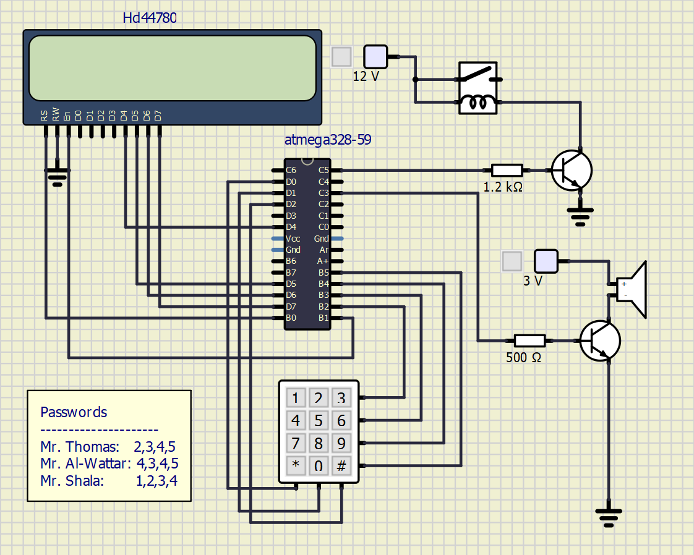
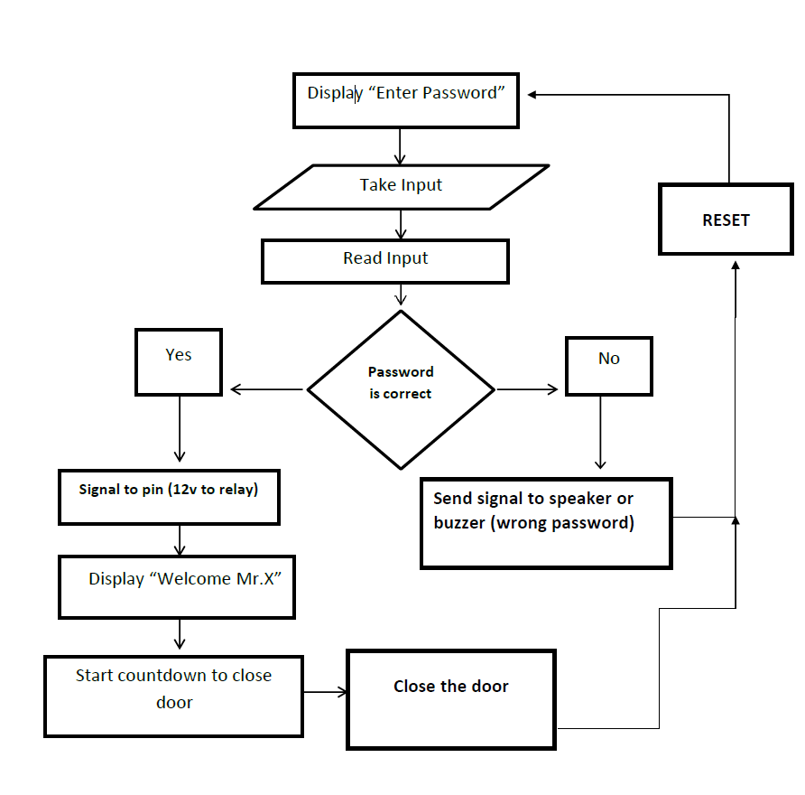
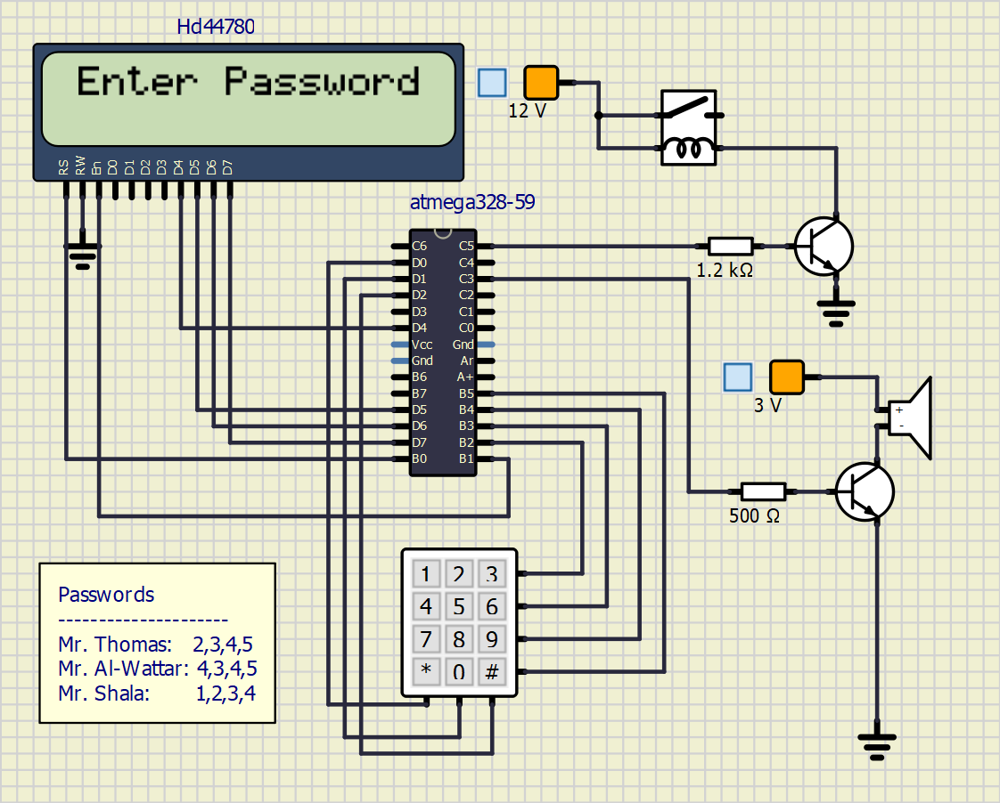

### Participants in the project: [Kreshnik Shala](https://github.com/ShalaKreshnik) and [Nadir Osman Al-Wattar](https://github.com/Nadir011995)
----------------------------------------------------------------------------------------------------------------------------------------------------------------------------
# Project: Smart Door Locking System
## Project objectives

Unlike the traditional door lock system, keypad door locks do not have any need for physical keys. They are basically keyless, that is, anyone can lock or unlock them even without keys. Technically, they work like the ATMs (automated teller machine). People only need to punch in their secret combination numbers in order to lock or unlock their doors. With this kind of entry system, people no longer have to worry about lost or stolen keys and they never have to bring keys with them everywhere they go or hide them in secret places to keep them away from the hands of unauthorized individuals. 
The secret numbers of the keypad door locks can be easily changed into another combination. When people feel that their current number combinations have been divulged to unauthorized individuals, they can always change the codes anytime. In addition, if the current owners of the house decide to sell the property or have the house rented to others, they can always just let the new people living there know about the access codes to the locks. There is no need to change locks at all. 
The aim of this project therefore is to design and construct a keypad/password based electronic door access key that will be able to:

* Eliminate the use of mechanical/metallic keys.
* Prevent events of key misplacements.
* Avoid excessive key duplication for everyone in the house.
* Make the apartment where it is installed more difficult to break into.

In order for this application of the door lock system to work, we need: 
4x3 keyboard; display; door unlock relay; own library for keypad scanning; time limit for entering the correct 4-digit code; several correct codes to distinguish more people; signaling of entering the wrong code; time delay for re-locking the lock approx. 2 to 3 seconds; sending interesting information about the status of the application to the UART.

_________________________________________________________________________________________________________________________________________________________________________________

## Hardware description

* ATmega328P 8-bit microcontroller.
* 4x3 keyboard
* Door unlock relay
* Bipolar transistor_1
* Bipolar transistor_2
* Resistor 1.2kOhm
* Audio output (Speaker)
* Display (Hd44780)
* 12V Supply_1
* 3V Supply_2

#### Circuit Diagram
* Concept presentation [Circuit_1](Images/Completed_circuit.png)
 

#### Updated Circuit: 

_________________________________________________________________________________________________________________________________________________________________________________

## Software

* Atmel Studio 7
* SimulIDE, real time electronic circuit simulator.

_________________________________________________________________________________________________________________________________________________________________________________

## Concept Presentation
#### Flowchart Diagram

* Concept presentation [Flowchar_1](Images/Flowchar.png)

#### Updated Flowchar: 

_________________________________________________________________________________________________________________________________________________________________________________

## Code description and simulations

#### Simulation: 

#### Libraries from previous labs:

* [gpio.c](Door_Lock_System/Door_Lock_System/gpio.c) 
* [gpio.h](Door_Lock_System/Door_Lock_System/gpio.h) 
* [lcd.c](Door_Lock_System/Door_Lock_System/lcd.c) 
* [lcd.h](Door_Lock_System/Door_Lock_System/lcd.h)
* [lcd_definitons.h](Door_Lock_System/Door_Lock_System/lcd_definitons.h)
* [timer.h](Door_Lock_System/Door_Lock_System/timer.h)
* [uart.c](Door_Lock_System/Door_Lock_System/uart.c)
* [uart.h](Door_Lock_System/Door_Lock_System/uart.h)

#### Own librarys for keypad scanning:

* [Keypad.h](Door_Lock_System/Door_Lock_System/keypad.h)
* [Keypad.c](Door_Lock_System/Door_Lock_System/keypad.c)

#### The functions in the keypad library:

-	[void keypad()](Door_Lock_System/Door_Lock_System/keypad.c): The pressed keypad is scanned and stored in a char array variable.

*	[void Check_password()](Door_Lock_System/Door_Lock_System/keypad.c): The entered password will be compared with the correct passcode

*	[void Check_password_1()](Door_Lock_System/Door_Lock_System/keypad.c): The same implementation as the previous function. Here we will compare the second correct passcode.

*	[void Check_password_2()](Door_Lock_System/Door_Lock_System/keypad.c): The same implementation as the previous function. Here we will compare the second correct passcode. 

*	[void reset()](Door_Lock_System/Door_Lock_System/keypad.c): This function is for cleaning and resetting the display. The variables are set to their initial state. The audio is deactivated.

*	[void entry_denied()](Door_Lock_System/Door_Lock_System/keypad.c): This function shows, the message “Wrong Password” on the display. This function operates when the entered passwords are incorrect. The audio is activated.

* [void entry_accepted()](Door_Lock_System/Door_Lock_System/keypad.c): If the entered password matches with the correct passcodes, this function will be operated. The message e.g “Welcome Mr. Thomas” is shown on the display. The relay will be activated. 

#### The interrupt handlers in [main.c](Door_Lock_System/Door_Lock_System/main.c): 

*	[TIMER0_OVF_vect](Door_Lock_System/Door_Lock_System/main.c): The TIM0 is enabled with a 4 millisecond overflow time. At the beginning in Interrupt Handler, there is the if statement with the condition timecheck> 100. This means that the data will be sent after 400 milliseconds via UART and to the LCD display.

*	[TIMER1_OVF_vect](Door_Lock_System/Door_Lock_System/main.c):  The TIM1 is enabled with 1 second. There is also data sending via UART. This interrupt handler is created for delay. It counts down10 seconds for entering the password, 10 seconds with correct password, 1 second for "Wrong Password" is displayed and the buzzer is activated for 1 second too.

_________________________________________________________________________________________________________________________________________________________________________________

## Video/Animation

* -1) If the correct password "1234" is entered:

* -2) If the wrong password is entered:

* -3) Displaying the data via UART with correctly entered passwords and incorrectly entered passwords:

_________________________________________________________________________________________________________________________________________________________________________________

## References

1.  [What is a flowchart?](https://www.breezetree.com/articles/what-is-a-flow-chart) 
2.  [What is a Relay? How does a Relay works?](https://www.youtube.com/watch?v=1_YfuH_AcxQ)
3.  [How to connect the relay and transistor with microcontroller](http://electronicsdrive.blogspot.com/2015/03/how-to-calculate-base-resistance.html)
4.  [ATmega32 + LCD + Keypad Interface](https://extremeelectronics.co.in/avr-tutorials/4x3-matrix-keypad-interface-avr-tutorial/)
5.  [Example of keypad.h which can give us an overview](https://playground.arduino.cc/Code/Keypad/)
6.  [Transistor audio connection](https://theorycircuit.com/simple-single-transistor-audio-amplifier-circuit/)
7.  [ASCII](http://www.asciitable.com/)
